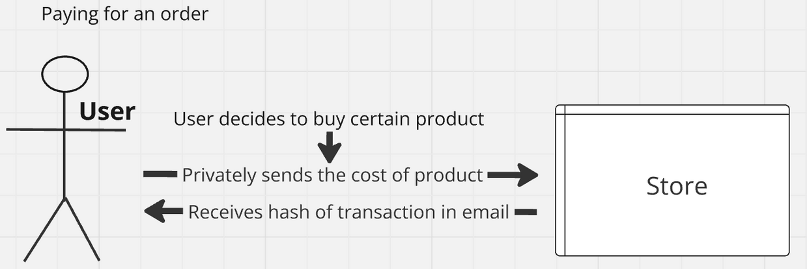
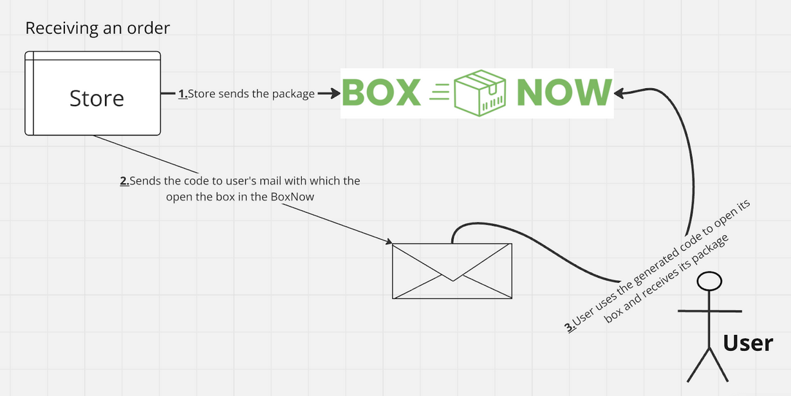

# ZeKshop
Check the [official paper of ZeKshop](./ZeKshop-whitepaper.pdf)
## Abstract

ZeKshop addresses the severe privacy issues in purchasing erotic merchandise by using Aztec, a privacy-first Layer 2 on Ethereum. By leveraging zero-knowledge proofs, ZeKshop ensures confidential transactions, secure communications, and anonymous order deliveries without collecting personal data from users. This document outlines the key features of ZeKshop, including private payment methods, order receipt through BoxNow, and secure communication using zkemail.

## Introduction

Shops that are selling and offering erotic merchandise (commonly referred to as “adult stores”) are targeting everyone that is an adult.They are presenting the opportunity to buy and order everything confidentially and without disclosure of personal data. They are trying to (as they say) collect as little personal data as possible and still If a personal data is collected by a third party, the data operator must ensure that personal data is collected legally. But as you can probably guess, there is a huge privacy issue. You are trusting them that they will collect as little data as possible, your eventually collected personal data might go to some third party that you don’t even know. There is no room for privacy here, you are just blindly trusting them. ZeKshop solves this severe privacy issue.

## Privacy reviews

Imagine buying a product and feeling either very satisfied or dissatisfied with its quality. You would naturally want to share your opinion to help others, as someone who has experienced the product firsthand. Of course, since you don’t want to reveal your identity, how can you share your valuable opinion? Zkmail is the answer!

## Communication Design

You might have already asked yourself: “How am I going to communicate privately with websites?” This is where ZeKshop leverages the zkemail library, in particular the zkemail.nr library. When you create an account you are going to have exclusive in-touch communication with the shop. It’s like a private messenger with the store. The store on the other hand, is going to communicate privately with every customer that has an email and has connected with it.

Note that the message and proof are sent to a server, which verifies and stores them without learning anything about the user. While the server can't alter messages due to ZK proof, it can censor or delete them. Using blockchain could prevent this, but it's costly. But since the store has absolutely no incentive in censoring or deleting the messages of customers with which it communicates, we are not going to use blockchain.

## Paying for an order

Aztec is the privacy-first Layer 2 on Ethereum. Private transactions in Aztec are designed to maintain user privacy by encrypting transaction details such as amounts and recipients. This is achieved through zero-knowledge proofs, which allow the network to verify the correctness of transactions without revealing any sensitive information. That’s why ZeKshop uses Aztec L2 on Ethereum to keep private the sender (user) and (optionally) the amount that are being used in a particular transaction. So the workflow is the following. User choses product(s) of choice and proceeds to payment. User confirms that wants to use a completely private method of payment and sends the required amount of his purchase within a private transaction. After the transaction is being successfully processed, the user will receive the hash of the transaction to his email that is associated with the store.

## Receiving an order

After a successful transaction (whose hash is already sent to the mail of the customer) all the notifications and updates regarding the purchase are being sent from the store’s mail account to the user’s mail account. We seek privacy and that means that who our customers are isn’t of our interest nor when they are collecting their packages. That’s why ZeKshop is using BoxNow as a way to collect your packet. BoxNow is a smart, parcel-receiving machine that allows orders to be delivered easily and quickly and obviously without any human interaction. As mentioned earlier, all communication is done via email, so the code to open the box where the user’s package is stored will be sent through email. The user simply goes to his local BoxNow machine, inputs the code that is sent to him via his email and finally receives its package!

## Basic workflow for paying and receiving an order

1. The user selects product(s) and proceeds to payment.
2. The user opts for a completely private payment method, utilizing Aztec L2 for secure transactions.
3. Upon successful processing, the user receives the transaction hash via email.
4. The user receives a code via email to unlock their package at a local BoxNow machine.
5. The package can be collected by entering the code, ensuring privacy and convenience.
6. The user can now use the transaction hash and submit an opinion about certain product without revealing its identity.
