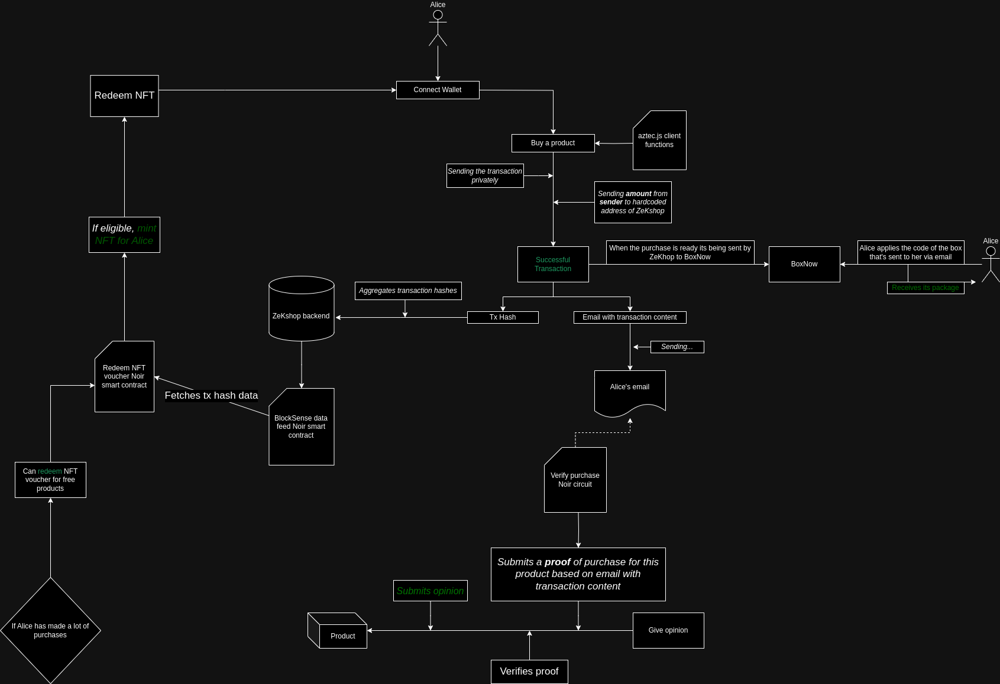

# ZeKshop

### [ZeKshop Demo](https://www.youtube.com/watch?v=MIDV-vBfs4s)

### [ZeKshop Whitepaper](./ZeKshopWhitepaper.pdf)

## Abstract

ZeKshop addresses the severe privacy issues in purchasing erotic merchandise by using Aztec, a privacy-first Layer 2 on Ethereum. ZeKshop is a privacy-centric adult store using cryptography to protect user anonymity. Purchases are secured via Aztec Layer 2 with zero-knowledge proofs, while zkEmail library enables private, verified reviews and communication with the store. Loyal customers can earn on-chain NFT vouchers for free products, ensuring both privacy and rewards. The purchases are being privately collected with the parcel-receiving machines BoxNow. This document outlines the key features of ZeKshop, including private payment methods, order receipt through BoxNow, secure communication and privately sharing opinion on product using zkemail.

## Diagram

## [ZeKshop's X (formerly Twitter)](https://x.com/ZeKshopOfficial)
